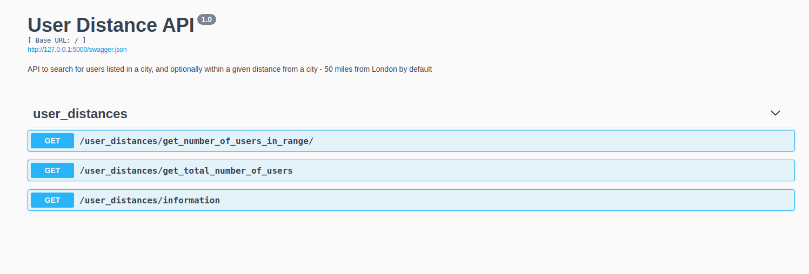

Flask API demo to find users near London

This API uses the bpdts-test-app API, returning users who are either listed as living in a given city or whose current location is within a requested number of miles of that city.

Options available are:


http://localhost:5000/user_distances/get_number_of_users_in_range/

This request returns the number of users who are either listed as living in London or whose current coordinates are within 50 miles of London.

http://localhost:5000/user_distances/get_number_of_users_in_range/?city=London&return_users=false&find_users_in_range=true&distance=50&latitude=51.506&longitude=-0.1272
```

This is for more generic use, where you can give your own location and coordinates.


## Requirements

Python 3
pip3
virtualenv
Ubuntu 20.04

### Setup virtual environment in Bash

pip3 install virtualenv

whichoutput = `which python3`
virtualenv -p $whichoutput venv

source venv/bin/activate

# Now, install the required software in the virtual environment
pip install -r requirements.txt

# Run the flask api
python run.py

# Run tests with Pytest


python -m pytest -s tests


From the project root folder, open your web-browser to http://127.0.0.1:5000 to view the Swagger API GUI with documentation. 

Requests can be executed from the Swagger GUI.



The API requests can also be called directly, e.g.

http://127.0.0.1:5000/user_distances/get_number_of_users_in_range/

or

http://127.0.0.1:5000/user_distances/get_number_of_users_in_range/?city=London&return_users=false&find_users_in_range=true&distance=50&latitude=51.506&longitude=-0.1272